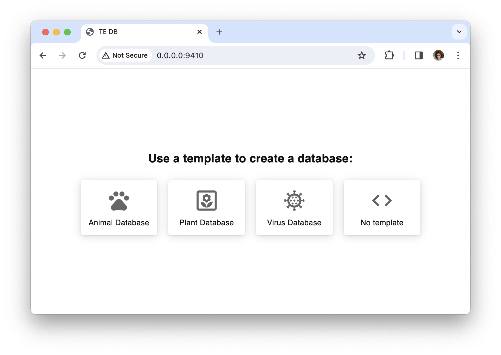

# BearBase

BearBase simplifies specimen collection management for clinics, zoological institutes, and small hospitals,
offering user-friendly virtual fields that enable professionals to create customized databases without complex
configurations. Built-in data validation ensures data accuracy, providing a streamlined solution for biologists
and zoologists in the field and reducing the need for specialized database expertise.

## Table of Contents

- [Installation](#installation)
- [Quick Start](#quick-start)
- [Development](#development)

## Docker

```bash
docker run -d -p 9420:9420 -p 9410:9410 oboik/bearbase
```

After running this command, you will have access to two servers:  
[http://0.0.0.0:9410/](http://0.0.0.0:9410/) - version for editing and administration (reading and writing)  
[http://0.0.0.0:9420/](http://0.0.0.0:9420/) - public version (read only). Ready to publish website collection



## Installation

To get started with BearBase, follow these steps:

1. Clone the repository:

   ```bash
   git clone git@github.com:comp-bio/BearBase.git
   ```

2. Change the directory to BearBase:

   ```bash
   cd BearBase
   ```

3. Install the required dependencies:

   ```bash
   # source ./venv/bin/activate
   pip install -r requirements.txt
   ```

## Quick Start

You can quickly launch BearBase using the following commands:

- **Read-only version:**

  ```bash
  python3 run.py server
  ```

- **Editable version:**

  ```bash
  python3 run.py server -editable Yes
  # database will be available at http://127.0.0.1:9400
  ```

- **Editable version with a custom database & port:**

  ```bash
  python3 run.py server -editable Yes -db Default.library -port 8080
  # database will be available at http://127.0.0.1:8080
  ```

## Development

For development purposes, you can use the following commands:

- **Start a Python server:**

  ```bash
  yarn py
  ```

- **Run a development server with content hot reload (for development):**

  ```bash
  yarn server
  ```

- **Build all static content for production:**

  ```bash
  yarn build
  ```

- **Rebuild static content and remove old build files:**

  ```bash
  yarn rebuild
  ```
